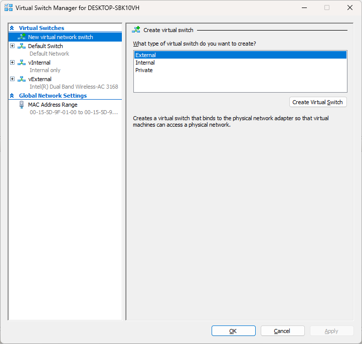
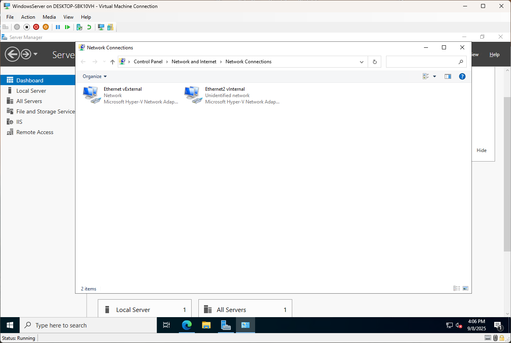
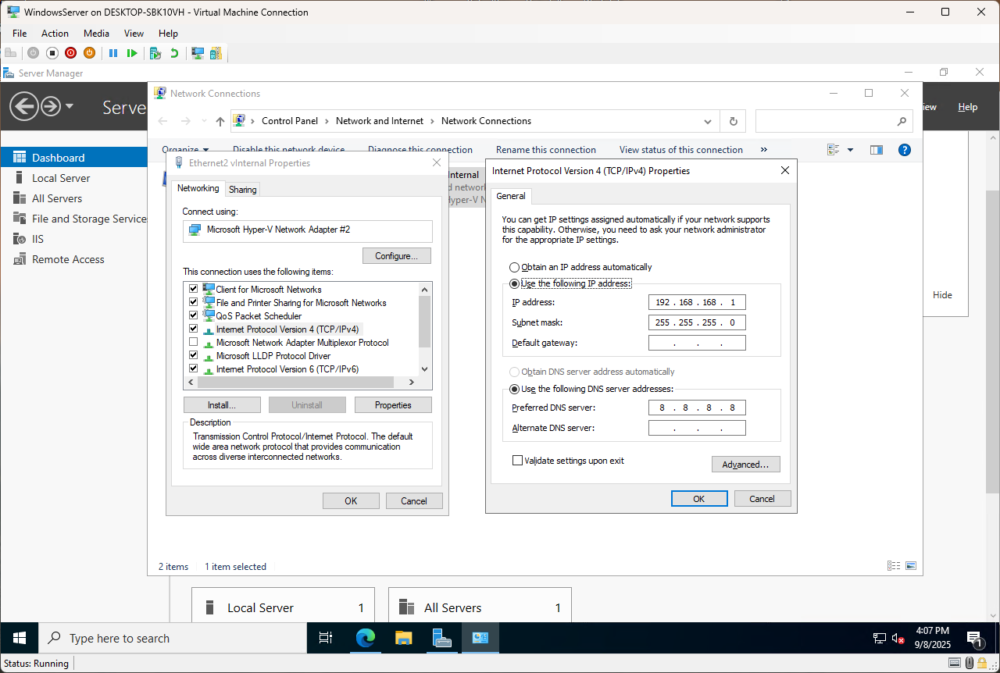
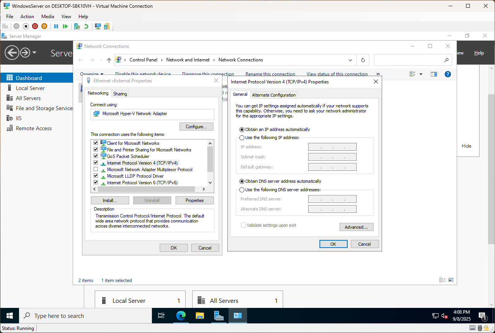
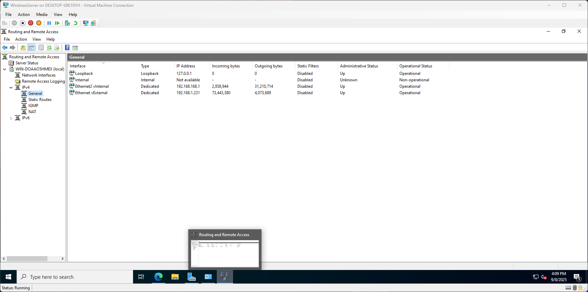
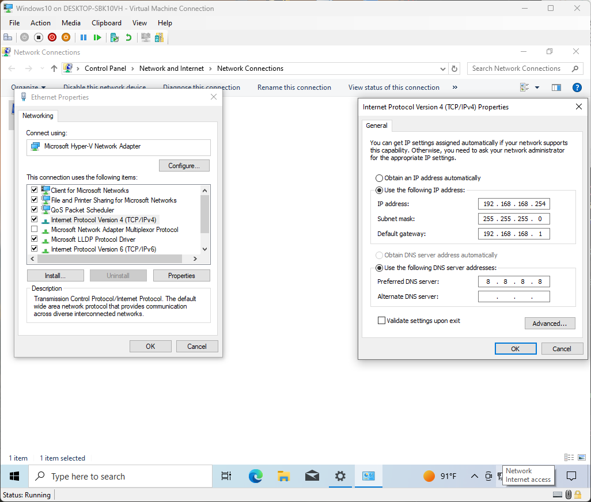
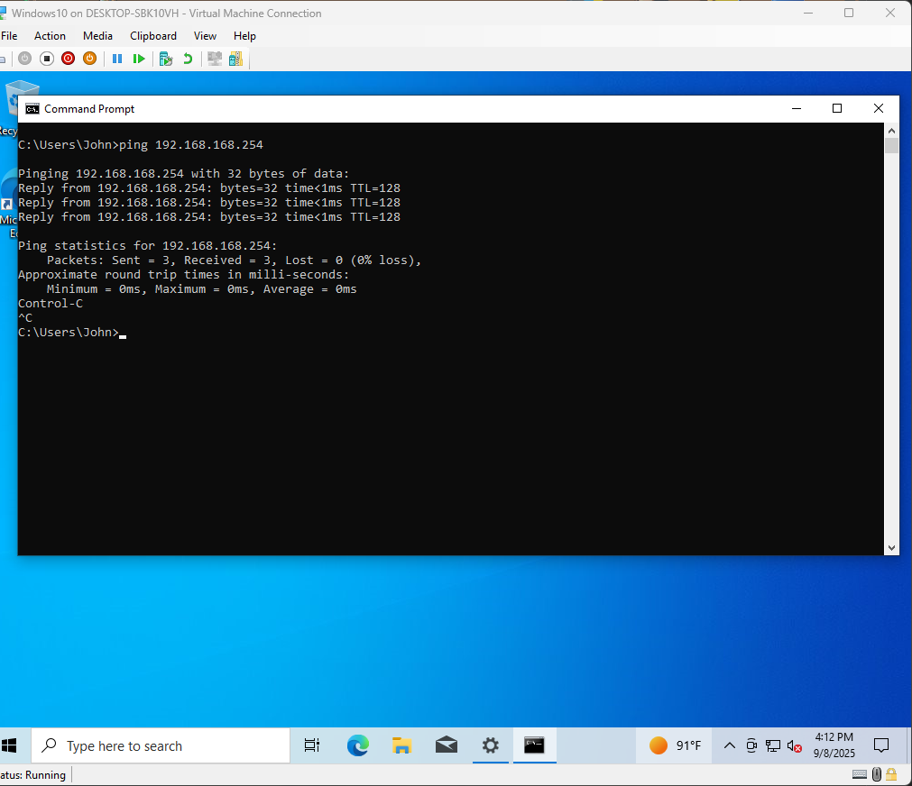
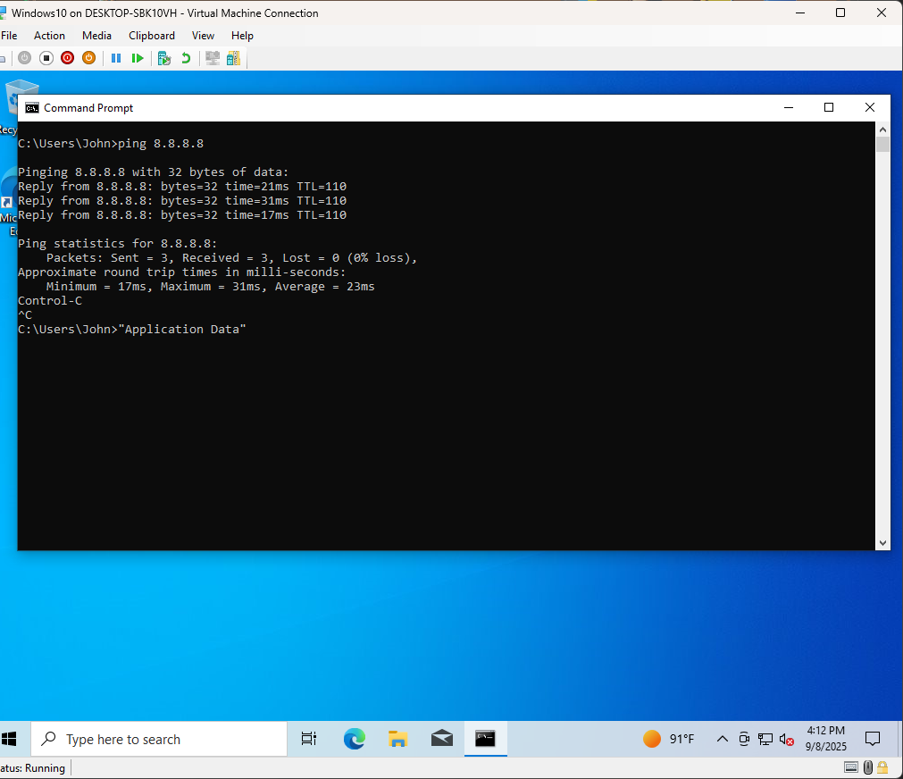
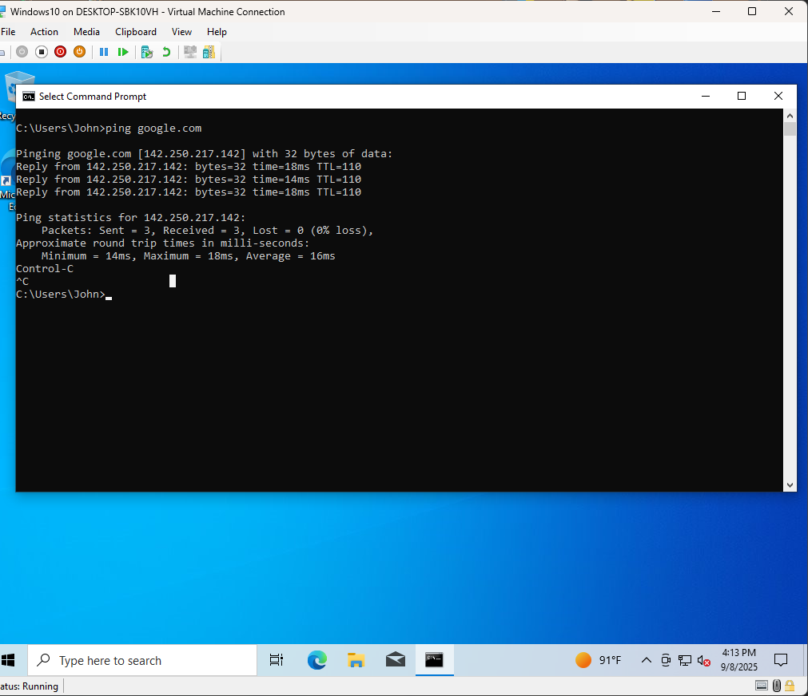

2025-09-08 15:34

# Windows Server NAT/Firewall Lab in Hyper-V

## Overview
This lab demonstrates how to use **Windows Server 2022** as a firewall/router in a Hyper-V environment.  
The goal was to replicate a setup I previously built using **Ubuntu Server + Kali**, where the client VM’s internet access is routed through a server VM acting as a NAT gateway.  

By the end of this lab:
- **Windows 10 Client VM** can only reach the internet by forwarding traffic through the **Windows Server 2022 NAT gateway**.
- This simulates a basic enterprise environment where a firewall/router controls outbound client traffic.

---

## Lab Architecture

        [ Internet / Home Router ]
                    │
         (Hyper-V vExternal Switch)
                    │
    ┌──────────────────────────────────┐
    │     Windows Server 2022 VM       │
    │  External NIC: DHCP from router  │
    │  Internal NIC: 192.168.168.1/24  │
    │  Role: RRAS (NAT & Routing)      │
    └──────────────────────────────────┘
                    │
         (Hyper-V vInternal Switch)
                    │
    ┌──────────────────────────────────┐
    │     Windows 10 Client VM         │
    │  IP: 192.168.168.2/24            │
    │  Gateway: 192.168.168.1          │
    │  DNS: 8.8.8.8                    │
    └──────────────────────────────────┘


---

## Setup Steps

### 1. Hyper-V Networking
- Created **vExternal switch** → bound to host’s physical NIC (internet access).
- Created **vInternal switch** → private lab network between VMs.
	
- Important: Host originally had `192.168.168.1` assigned to `vInternal`.  
  - This conflicted with the Server VM’s internal NIC.  
  - Fixed by moving host’s vInternal IP to `192.168.168.254`.

### 2. Windows Server 2022 VM
- Generation 2 VM, 8 GB RAM, 60 GB disk.
- Installed **Windows Server 2022 Standard (Desktop Experience)**.
- Added **two NICs**:
  - External NIC → vExternal switch (DHCP, e.g., `192.168.1.231`).
  - Internal NIC → vInternal switch (static `192.168.168.1`).
	  
	  
	  
- Installed **RRAS role**:
  - Roles → Remote Access → Routing.
  - Configured NAT:
    - External NIC = Public, NAT enabled.
    - Internal NIC = Private.
		
### 3. Windows 10 Client VM
- Generation 2 VM, 6 GB RAM, 60 GB disk.
- Attached NIC → *vInternal* switch only.
- Static IP config:
  - IP: `192.168.168.2`
  - Subnet: `255.255.255.0`
  - Gateway: `192.168.168.1`
  - DNS: `8.8.8.8`
	

---

## Verification

In order to test connectivity, I pinged the Windows Server, google.com & 8.8.8.8 all from the Windows 10 Client. All came out successful.

On **Windows 10 Client**:


```powershell
ping 192.168.168.254 #  replies from Server's internal NIC
ping 8.8.8.8         #  succeeds via NAT
ping google.com      #  DNS resolution working
```







## Conclusion / Things Learned

In this lab I was able to set up a Windows Server 2022 VM in Hyper-V and use it as a NAT router/firewall for a Windows 10 client. I built the network with two Hyper-V switches: an **External switch** that connected the Server VM to my home network for internet access, and an **Internal switch** that created a private subnet where my Server and Client could communicate.  

One of the biggest things I learned was how important the **default gateway** is. My Windows 10 VM could talk to other devices on the 192.168.168.x subnet, but anything outside that subnet had to go through the Server VM (192.168.168.1). This really showed me how a gateway works in practice.  

I also learned about **NAT with RRAS** and how Windows Server can translate traffic from one network to another. This reminded me of how a home router works, but I got to configure it myself.  

A problem I ran into was an **IP conflict**: I had accidentally assigned 192.168.168.1 to both my host machine’s vInternal adapter and the Server VM. This caused the Server VM to drop into a 169.254.x.x address and break connectivity. Once I fixed that by moving the host to 192.168.168.254, the Server was able to stay on 192.168.168.1 and everything worked. That mistake helped me understand why duplicate IPs are such a problem.  

Overall, this lab helped me better understand **subnets, gateways, and NAT**. It was a good step toward learning how enterprise networks are set up, and I now feel more confident about building firewall and routing labs in the future.
